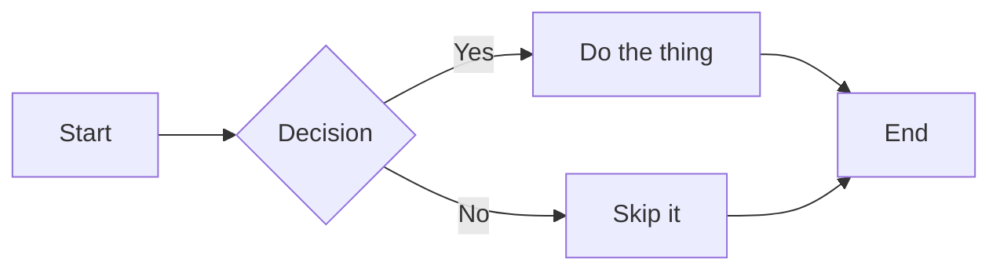
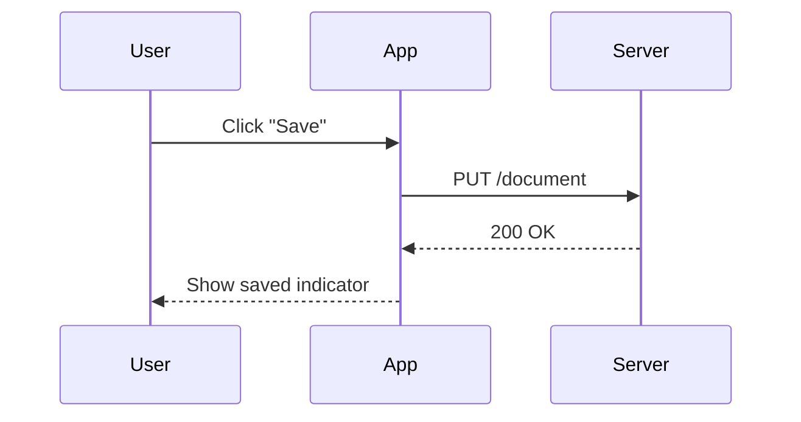
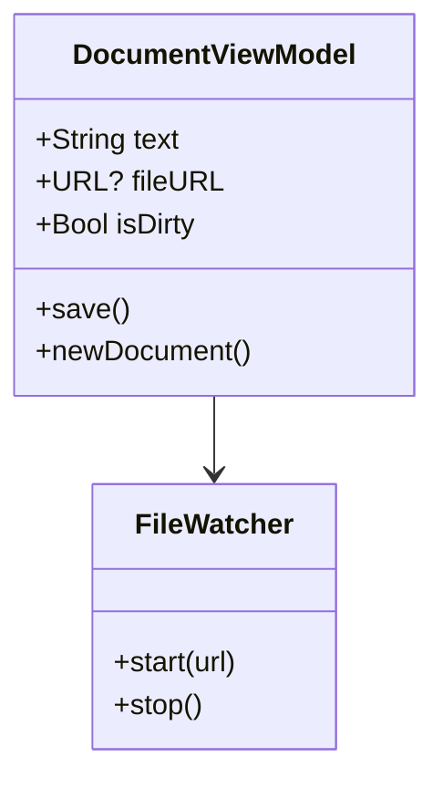
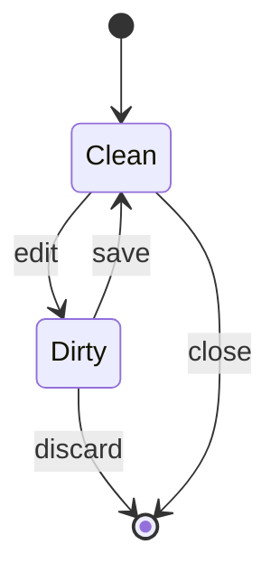
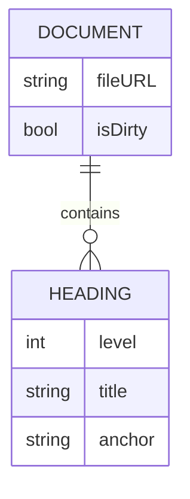
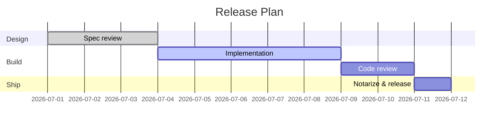
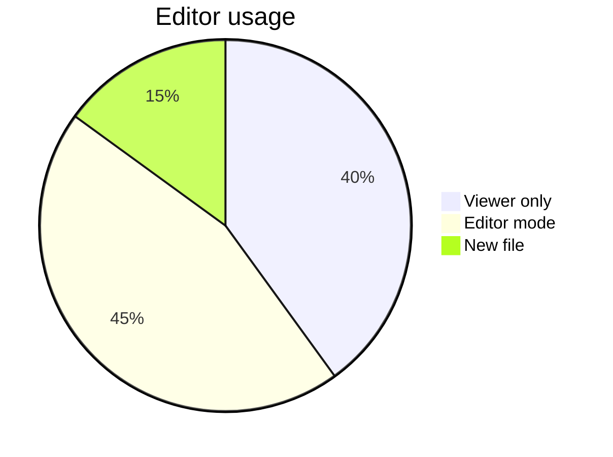
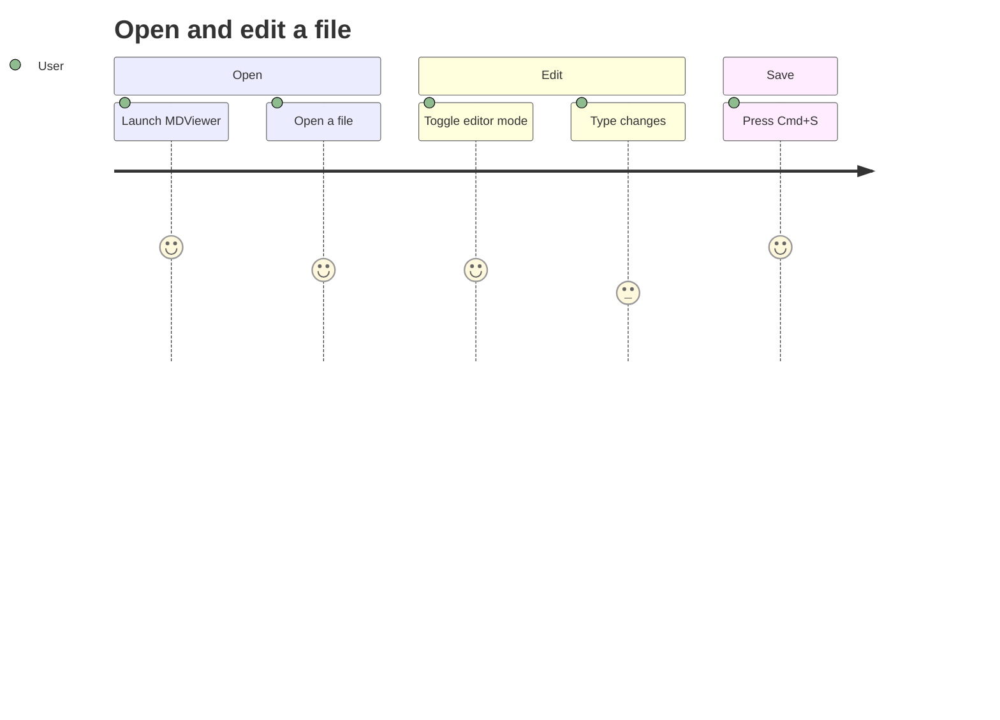
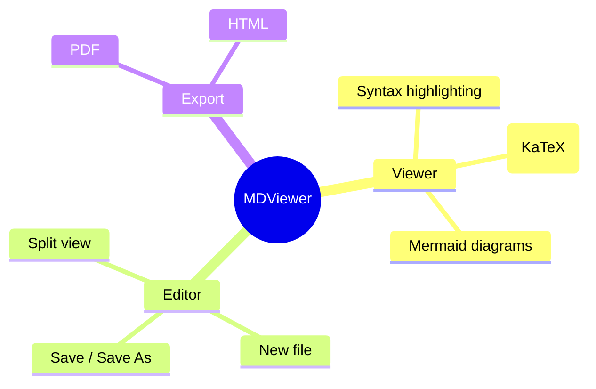
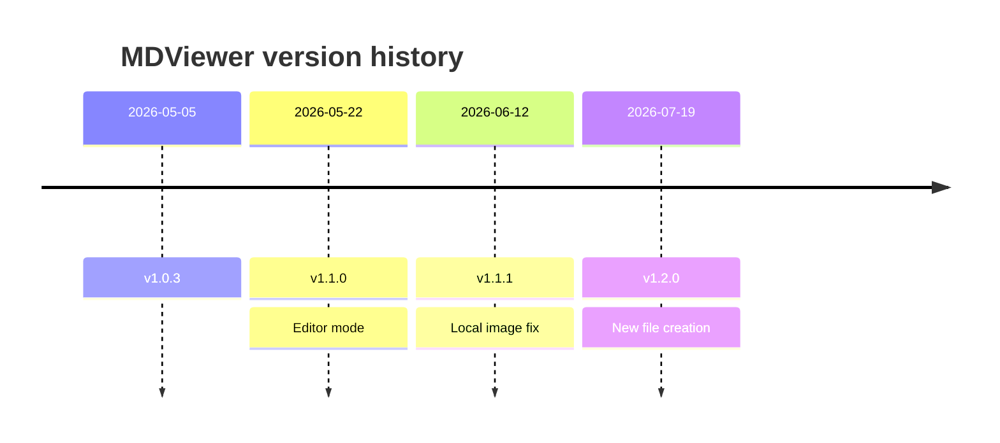

# MDViewer Help

A reference for Markdown and Mermaid diagram syntax, with live-rendered examples. Use the sidebar to jump to a section.

---

## Headings

Six levels, `#` through `######`.

```
# Heading 1
## Heading 2
### Heading 3
#### Heading 4
##### Heading 5
###### Heading 6
```

# Heading 1
## Heading 2
### Heading 3
#### Heading 4
##### Heading 5
###### Heading 6

---

## Emphasis

```
*italic* or _italic_
**bold** or __bold__
***bold italic***
~~strikethrough~~
```

*italic* or _italic_
**bold** or __bold__
***bold italic***
~~strikethrough~~

---

## Lists

### Unordered

```
- Item one
- Item two
  - Nested item
- Item three
```

- Item one
- Item two
  - Nested item
- Item three

### Ordered

```
1. First step
2. Second step
   1. Sub-step
3. Third step
```

1. First step
2. Second step
   1. Sub-step
3. Third step

### Task list

```
- [x] Done
- [ ] Not done
```

- [x] Done
- [ ] Not done

---

## Links and images

```
[MDViewer on GitHub](https://github.com)

```

[MDViewer on GitHub](https://github.com)

---

## Blockquotes

```
> A single-line quote.
>
> A quote can span
> multiple lines.
```

> A single-line quote.
>
> A quote can span
> multiple lines.

---

## Code

Inline code: `` `let x = 1` `` renders as `let x = 1`.

Fenced code block with a language tag for syntax highlighting:

````
```swift
func greet(name: String) -> String {
    "Hello, \(name)!"
}
```
````

```swift
func greet(name: String) -> String {
    "Hello, \(name)!"
}
```

---

## Tables

```
| Feature      | Supported |
| ------------ | --------- |
| Tables       | Yes       |
| Footnotes    | Yes       |
| Mermaid      | Yes       |
```

| Feature      | Supported |
| ------------ | --------- |
| Tables       | Yes       |
| Footnotes    | Yes       |
| Mermaid      | Yes       |

---

## Footnotes

```
Here is a footnote reference.[^1]

[^1]: This is the footnote content.
```

Here is a footnote reference.[^1]

[^1]: This is the footnote content.

---

## Horizontal rule

```
---
```

---

## Math (KaTeX)

Inline math: `$E = mc^2$` renders as $E = mc^2$.

Block math:

```
$$
\int_0^\infty e^{-x^2} \, dx = \frac{\sqrt{\pi}}{2}
$$
```

$$
\int_0^\infty e^{-x^2} \, dx = \frac{\sqrt{\pi}}{2}
$$

---

## Mermaid diagrams

MDViewer renders [Mermaid](https://mermaid.js.org) diagrams inside fenced code blocks tagged `mermaid`. Note: to *document* the syntax on this page, the outer fence below uses 4 backticks so the inner 3-backtick example stays literal — in your own files, 3 backticks around a `mermaid` block is all you need.

### Flowchart

````

````


### Sequence diagram

````

````


### Class diagram

````

````


### State diagram

````

````


### Entity relationship diagram

````

````


### Gantt chart

````

````


### Pie chart

````

````


### User journey

````

````


### Mindmap

````

````


### Timeline

````

````


---

## Tips for this app

- **Live preview**: while in editor mode (⌘E), the preview pane updates as you type.
- **Table of contents**: the sidebar (⌘⇧S) lists headings from the current document — including this one.
- **Theme**: pick a light or dark syntax theme from the toolbar palette icon.
- **Export**: render this or any document to PDF or HTML from the Export menu.
