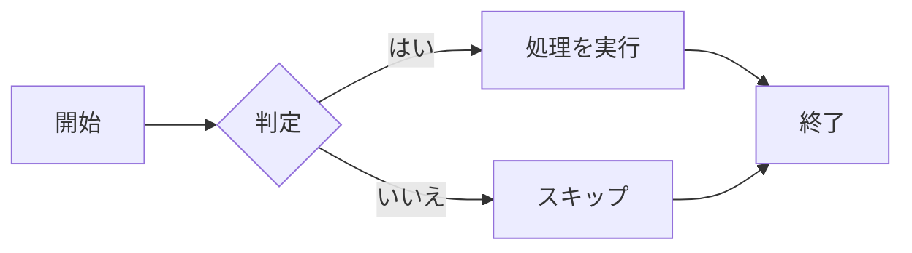
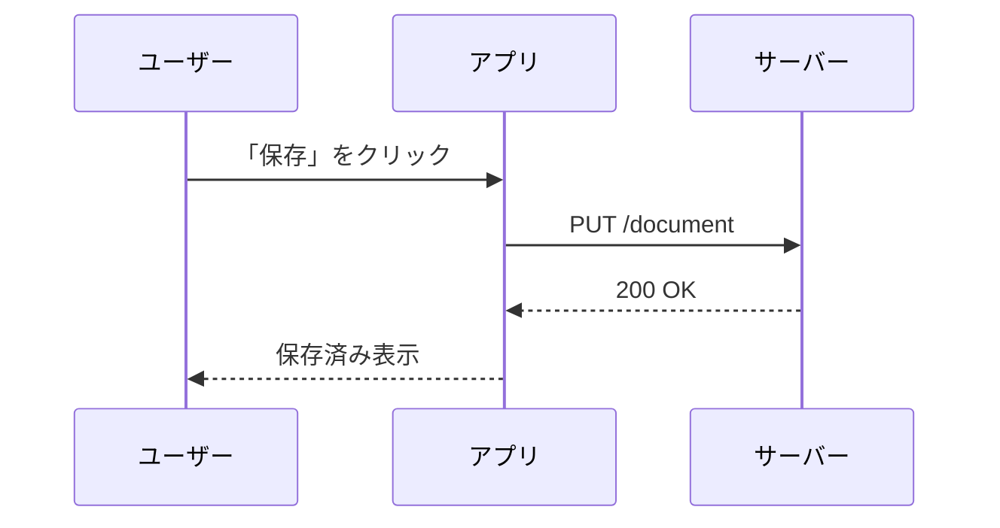
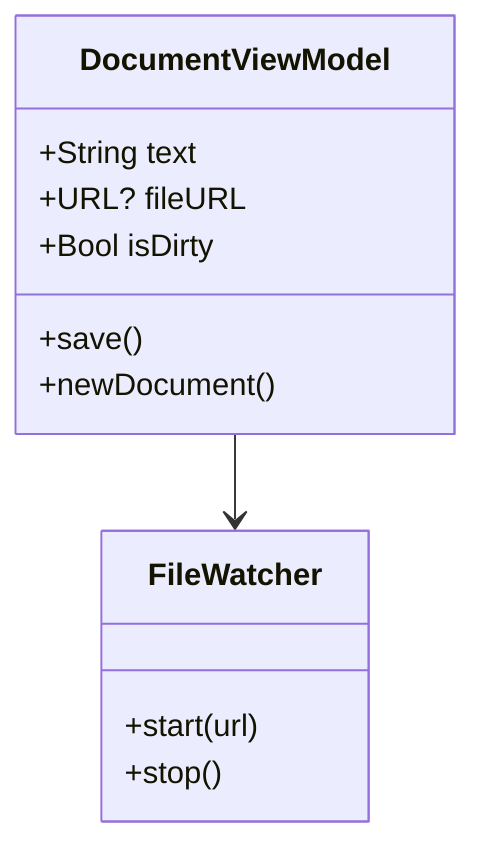
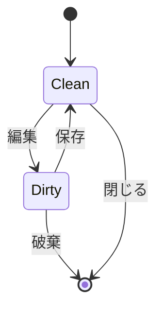
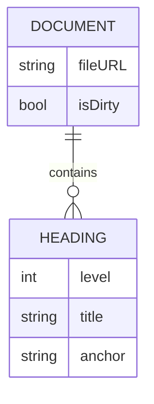
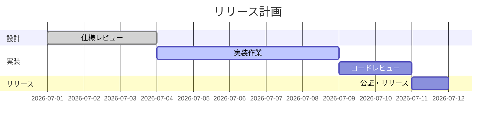
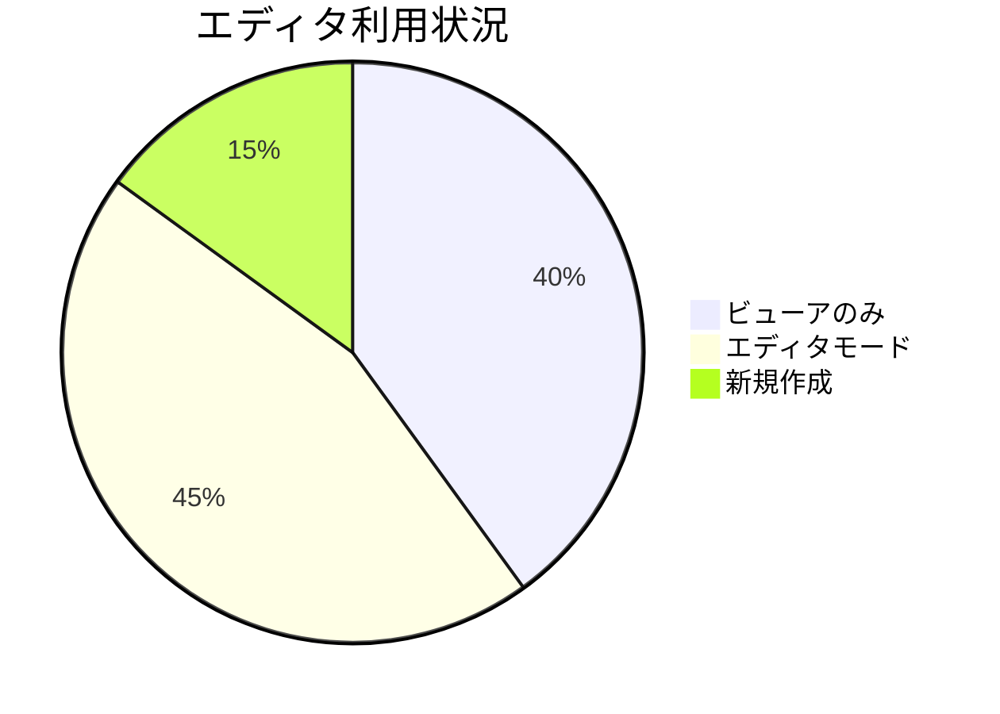
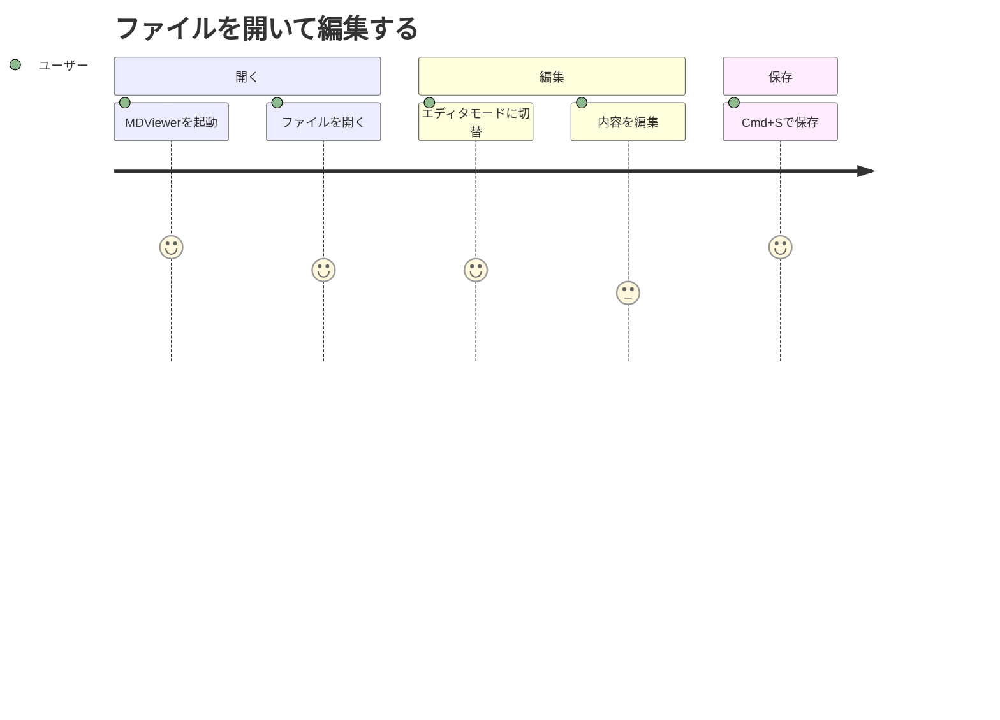
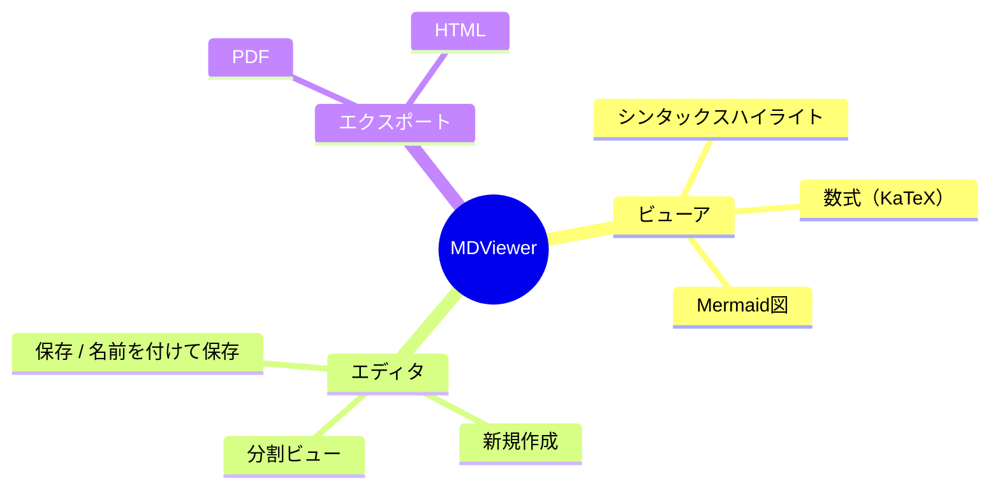
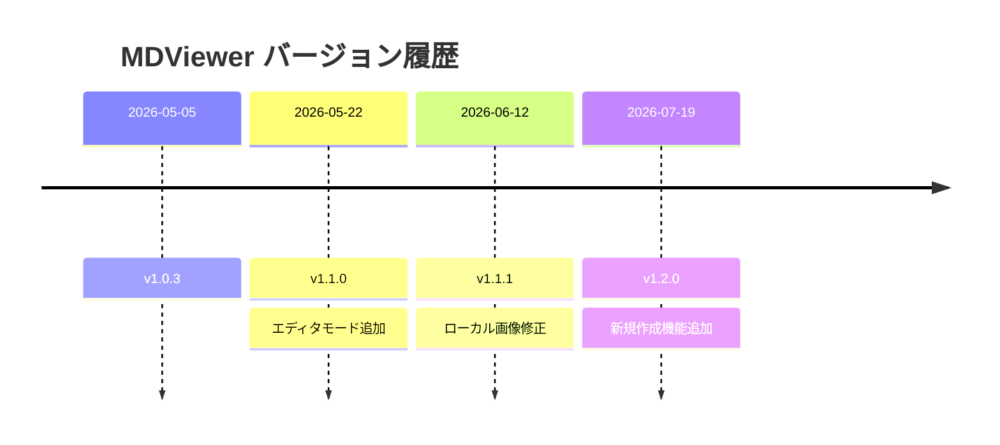

# MDViewer ヘルプ

MarkdownとMermaid記法のリファレンスです。各記法をこの画面上で実際にレンダリングして示します。サイドバーから各セクションへ移動できます。

---

## 見出し

`#` から `######` まで6段階あります。

```
# 見出し1
## 見出し2
### 見出し3
#### 見出し4
##### 見出し5
###### 見出し6
```

# 見出し1
## 見出し2
### 見出し3
#### 見出し4
##### 見出し5
###### 見出し6

---

## 強調

```
*斜体* または _斜体_
**太字** または __太字__
***太字斜体***
~~取り消し線~~
```

*斜体* または _斜体_
**太字** または __太字__
***太字斜体***
~~取り消し線~~

---

## リスト

### 番号なしリスト

```
- 項目1
- 項目2
  - 入れ子の項目
- 項目3
```

- 項目1
- 項目2
  - 入れ子の項目
- 項目3

### 番号付きリスト

```
1. 手順1
2. 手順2
   1. 手順2の子項目
3. 手順3
```

1. 手順1
2. 手順2
   1. 手順2の子項目
3. 手順3

### タスクリスト

```
- [x] 完了した項目
- [ ] 未完了の項目
```

- [x] 完了した項目
- [ ] 未完了の項目

---

## リンクと画像

```
[MDViewer on GitHub](https://github.com)

```

[MDViewer on GitHub](https://github.com)

---

## 引用

```
> 一行の引用。
>
> 複数行にまたがる
> 引用も書けます。
```

> 一行の引用。
>
> 複数行にまたがる
> 引用も書けます。

---

## コード

インラインコード: `` `let x = 1` `` は `let x = 1` のように表示されます。

言語タグ付きのコードブロックはシンタックスハイライトされます。

````
```swift
func greet(name: String) -> String {
    "Hello, \(name)!"
}
```
````

```swift
func greet(name: String) -> String {
    "Hello, \(name)!"
}
```

---

## テーブル

```
| 機能         | 対応 |
| ------------ | ---- |
| テーブル     | ○   |
| 脚注         | ○   |
| Mermaid      | ○   |
```

| 機能         | 対応 |
| ------------ | ---- |
| テーブル     | ○   |
| 脚注         | ○   |
| Mermaid      | ○   |

---

## 脚注

```
本文に脚注を付けられます。[^1]

[^1]: これが脚注の内容です。
```

本文に脚注を付けられます。[^1]

[^1]: これが脚注の内容です。

---

## 水平線

```
---
```

---

## 数式（KaTeX）

インライン数式: `$E = mc^2$` は $E = mc^2$ のように表示されます。

ブロック数式:

```
$$
\int_0^\infty e^{-x^2} \, dx = \frac{\sqrt{\pi}}{2}
$$
```

$$
\int_0^\infty e^{-x^2} \, dx = \frac{\sqrt{\pi}}{2}
$$

---

## Mermaid図

MDViewerは`mermaid`タグを付けたコードブロック内の[Mermaid](https://mermaid.js.org)記法を図として描画します。以下の例では、この記法自体を*説明する*ため外側のフェンスを4つのバッククォートにして内側の3バッククォートの例をそのまま表示していますが、実際のファイルでは通常の3バッククォートで`mermaid`ブロックを囲むだけで構いません。

### フローチャート

````

````


### シーケンス図

````

````


### クラス図

````

````


### 状態遷移図

````

````


### ER図

````

````


### ガントチャート

````

````


### 円グラフ

````

````


### ユーザージャーニー

````

````


### マインドマップ

````

````


### タイムライン

````

````


---

## このアプリでの使い方

- **ライブプレビュー**: エディタモード（⌘E）では、入力に合わせてプレビューが即座に更新されます。
- **目次**: サイドバー（⌘⇧S）に現在のドキュメントの見出し一覧が表示されます。このヘルプ自体も同じ仕組みです。
- **テーマ**: ツールバーのパレットアイコンからシンタックスハイライトのテーマ（ライト/ダーク）を選べます。
- **エクスポート**: 「書き出し」メニューからこの文書を含めPDFやHTMLに変換できます。
