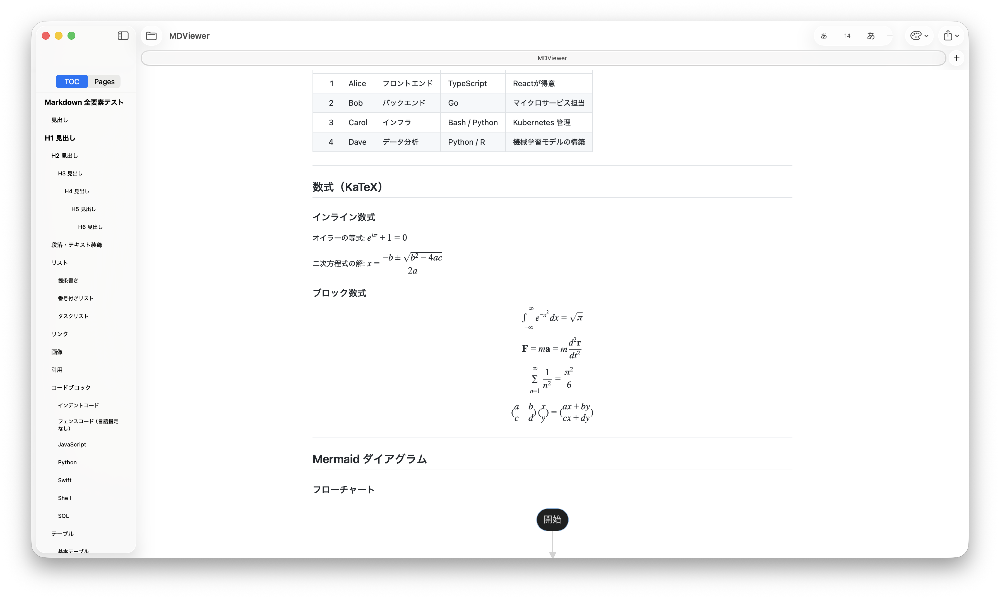

# MDViewer

A lightweight, native macOS Markdown viewer built for developers.



## Overview

MDViewer was created out of a simple need: a fast, minimal way to read `.md` files when working from the terminal with tools like Claude Code or Codex. It renders Markdown beautifully without the overhead of a browser or a full editor.

MDViewer started as a viewer — but we wanted editing too, so it now includes a built-in split-view editor.

## Features

- **Instant rendering** — opens and renders Markdown files immediately
- **Live reload** — watches for file changes and re-renders as you save
- **Table of contents** — auto-generated sidebar from headings with smooth scroll
- **Syntax highlighting** — 27 languages via [Shiki v1](https://github.com/shikijs/shiki)
- **Copy button on code blocks** — appears when you hover a code block
- **Themes and fonts** — six themes, and separate fonts for body text, headings and code (Settings > Appearance)
- **Math equations** — inline and block LaTeX via [KaTeX](https://github.com/KaTeX/KaTeX)
- **Mermaid diagrams** — flowcharts, sequence diagrams, Gantt charts, and more
- **Smart link handling** — local `.md` links open in-app; external links open in the browser
- **Export to PDF** — one-click PDF export preserving all styles
- **Signed & notarized** — Developer ID signing and Apple notarization

### Editor Mode

Toggle the built-in editor with **⌘E** or the pencil button in the toolbar.

- **Split view**: Editor on the left, live preview on the right
- **New file**: ⌘N, the toolbar button, or the welcome screen starts a blank document in editor mode
- **Save**: ⌘S saves changes to the current file; for a new (untitled) document it shows a save panel
- Unsaved changes are indicated by the Save button becoming active
- Closing the window, or starting a new file, with unsaved changes prompts Save / Discard / Cancel

### Help

Open "MDViewer Help" from the Help menu for a live-rendered reference covering all Markdown syntax and every Mermaid diagram type (flowchart, sequence, class, state, ER, Gantt, pie, user journey, mindmap, timeline).

## Requirements

- macOS 14 Sonoma or later
- Safari 17.4 or later, for Mermaid diagrams (Safari's WebKit draws the preview; update Safari if diagrams do not appear)
- Apple Silicon (M1 or later) or Intel Mac

## Installation

1. Download the zip for your Mac from the [Releases page](https://github.com/Masakai/mdviewer/releases/latest):
   - Apple Silicon (M1 or later): `MDViewer-AppleSilicon.zip`
   - Intel: `MDViewer-Universal.zip` (it also runs on Apple Silicon)
2. Unzip and drag `MDViewer.app` to your **Applications** folder
3. Double-click any `.md` file — or drop it onto the MDViewer icon in the Dock

## Building from source

Requires Xcode 15 or later.

```sh
git clone https://github.com/Masakai/mdviewer.git
cd mdviewer
open MDViewer.xcodeproj
```

Build and run with ⌘R. No Swift Package dependencies — all vendor libraries are bundled in `MDViewer/Resources/Web/vendor/`.

## Tech stack

| Layer | Technology |
|-------|-----------|
| UI framework | SwiftUI + AppKit |
| Rendering engine | WKWebView |
| Markdown parser | [marked](https://github.com/markedjs/marked) v12 |
| Syntax highlighting | [Shiki](https://github.com/shikijs/shiki) v1 |
| Math | [KaTeX](https://github.com/KaTeX/KaTeX) v0.18 |
| Diagrams | [Mermaid](https://github.com/mermaid-js/mermaid) v12 |
| File watching | `DispatchSource` (kqueue) |

## Open source libraries

The libraries below are MIT licensed. Mermaid's single-file build also includes its own dependencies, some under other licenses (Apache-2.0, EPL-2.0, ISC, BSD-3-Clause). See [THIRD_PARTY_NOTICES.md](THIRD_PARTY_NOTICES.md) for full license texts.

| Library | Version | License |
|---------|---------|---------|
| marked | 12.0.2 | MIT |
| Shiki | 1.x | MIT |
| KaTeX | 0.18.9 | MIT |
| Mermaid | 12.0.0 | MIT |

## License

MDViewer is released under the [MIT License](LICENSE).

© 2026 Masanori Sakai
